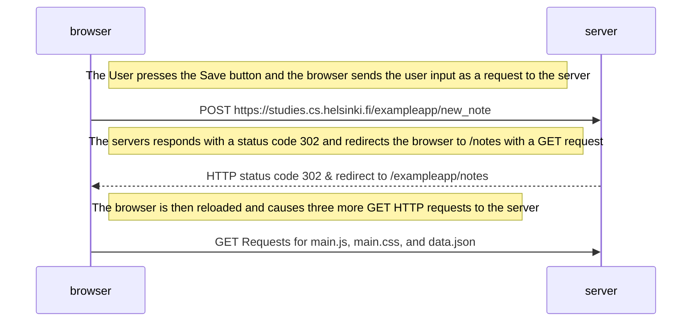

```mermaid
  sequenceDiagram
    participant browser
    participant server
    
    Note right of browser: The User presses the Save button and the browser sends the user input as a request to the server
    browser->>server: POST https://studies.cs.helsinki.fi/exampleapp/new_note
    
    Note left of server: The servers responds with a status code 302 and redirects the browser to /notes with a GET request
    server-->>browser: HTTP status code 302 & redirect to /exampleapp/notes
    
    Note right of browser: The browser is then reloaded and causes three more GET HTTP requests to the server
    browser->>server: GET Requests for main.js, main.css, and data.json
```