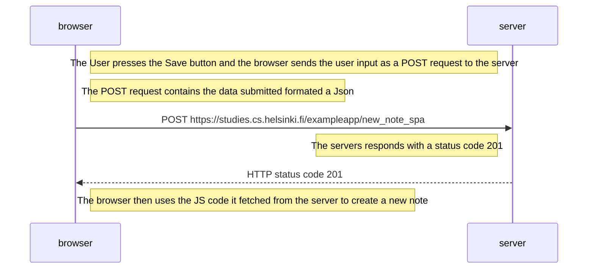

```mermaid
  sequenceDiagram
    participant browser
    participant server
    
    Note right of browser: The User presses the Save button and the browser sends the user input as a POST request to the server
    Note right of browser: The POST request contains the data submitted formated a Json
    browser->>server: POST https://studies.cs.helsinki.fi/exampleapp/new_note_spa
    
    Note left of server: The servers responds with a status code 201
    server-->>browser: HTTP status code 201
    
    Note right of browser: The browser then uses the JS code it fetched from the server to create a new note
```