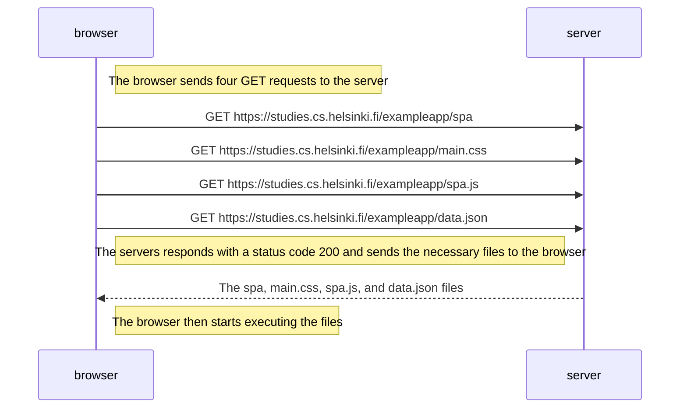

```mermaid
  sequenceDiagram
    participant browser
    participant server
    
    Note right of browser: The browser sends four GET requests to the server
    browser->>server: GET https://studies.cs.helsinki.fi/exampleapp/spa
    browser->>server: GET https://studies.cs.helsinki.fi/exampleapp/main.css
    browser->>server: GET https://studies.cs.helsinki.fi/exampleapp/spa.js
    browser->>server: GET https://studies.cs.helsinki.fi/exampleapp/data.json
    
    Note left of server: The servers responds with a status code 200 and sends the necessary files to the browser
    server-->>browser: The spa, main.css, spa.js, and data.json files
    
    Note right of browser: The browser then starts executing the files
```